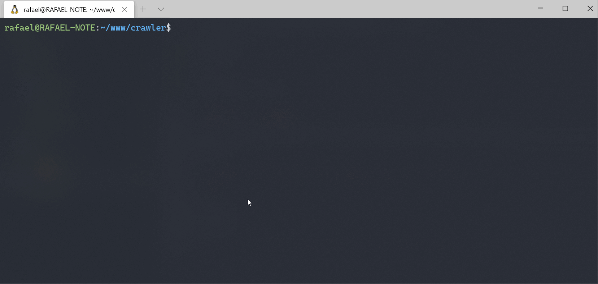

Aplicação simples para listar informações de Fundos Imobiliários do [Funds Explorer](https://www.fundsexplorer.com.br) no console. Criada apenas para fins didáticos e pessoais.

## Requisitos

- Node.js v12+

## Instalação e execução

- Instalação: `npm install`
- Renomear `funds-example.json` para `funds.json` e adicionar os FIIs desejados
- Executar: `ts-node list.ts`

## Opções

- `--portfolio=[0|1]` Filtra se o FII está na carteira do investidor ou não
- `--sort=[name|liquidity|dividendYield|equityValue|sharePrice|pvp|segment]` Ordena a tabela pela propriedade indicada.
- `--direction=[asc|desc]` Direção da ordenação

## Exemplos

- Exibir apenas os FIIs da carteira ordenado pelo P/VP, do maior para o menor
    - `ts-node list.ts --portfolio=1 --sort=pvp --direction=desc`